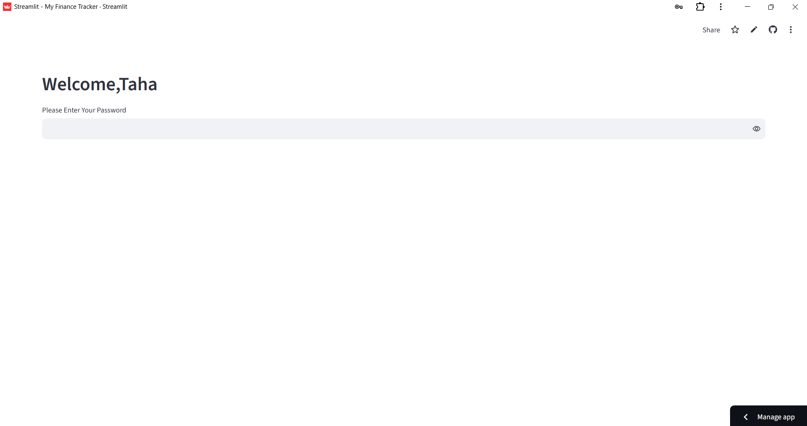
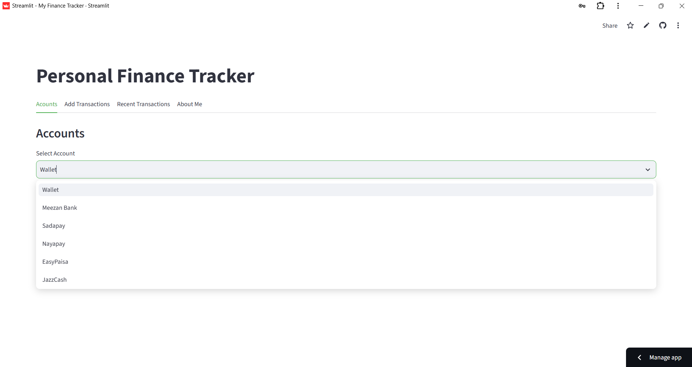
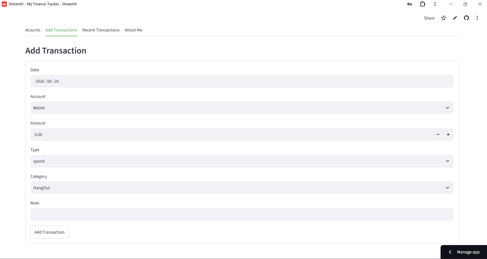
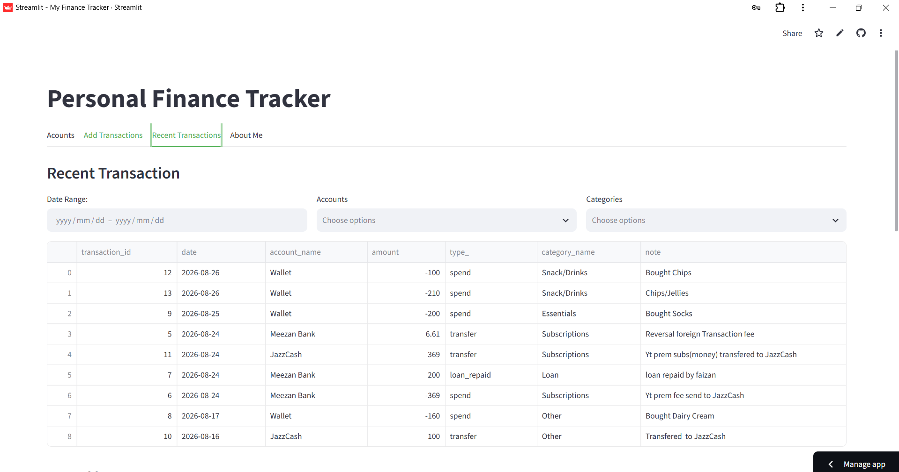
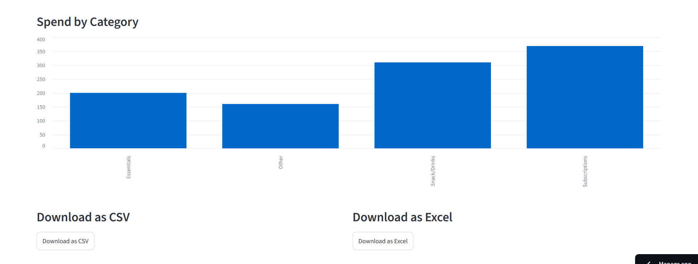
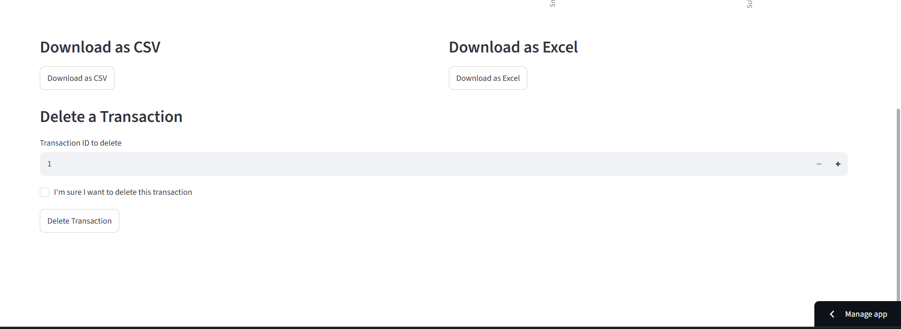

# Personal Finance Tracker
## Project Breakdown
* __Frontend: Streamlit creates an interactive web interface.__
* __Data Management: Pandas processes transaction data and handles CSV or Excel exports.__
* __Database: PostgreSQL hosted on Supabase stores user records securely via Psycopg connections.__
## Features
### Login 
* __Secure Access:Users log in with a password__

### Wallets
* __This section includes VI Different wallets:__
1. Wallet
2. Meezan Bank
3. SadaPay
4. NayaPay
5. EasyPaisa
6. JazzCash

### Add a Transactions
* __In this block you add your transactions__

### Recent Transactions
* __This Section is divided into three sections:__
* __View Recent Transactions__

* __Visualization: Displays spending categories through interactive graphs__

* __Transaction Management: Allows adding, viewing, downloading, and deleting records by transaction ID.__

## Technologies Used
* __Pandas__
* __Streamlit__
* __Postgres__
* __Supabase__
* __Psycopg__
## Future Goals
### Direct Transfers between Online Accounts
* __Instead of doing it in two steps,it will be done in one step__
